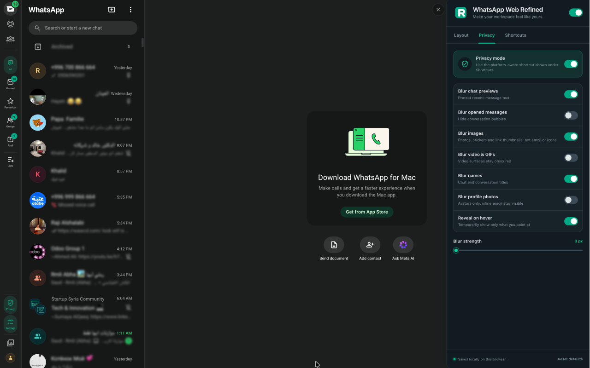
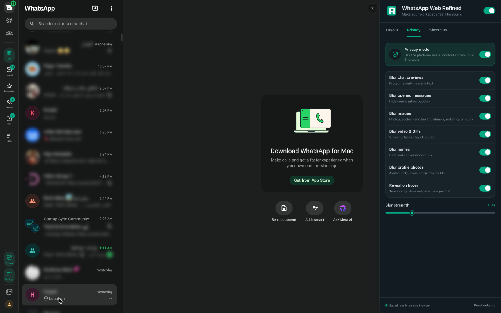

<div align="center">


# Refined WhatsApp™ Web

**Native-feeling layout, privacy, and keyboard controls for WhatsApp Web.**

[](CHANGELOG.md)
[](manifest.json)
[](LICENSE)
[](#privacy-by-design)



</div>

Refined WhatsApp™ Web is a focused Chrome extension that makes WhatsApp Web
calmer and more private — without making it feel like a different app. Every
control follows WhatsApp's own colors, spacing, shapes, and interaction
patterns, in both light and dark themes.

It is an independent project and is not affiliated with, endorsed by, or
sponsored by WhatsApp or Meta. WhatsApp is a trademark of WhatsApp LLC.

## Features

### Layout

- **Chat folders where you want them** — keep WhatsApp's filter tabs where
  they are, or mirror them into the existing navigation sidebar with unread
  badges and WhatsApp-style tooltips.
- **Resizable chat panel** — drag its edge, use arrow keys on the handle, or
  set an exact width that is remembered between sessions.
- **A quieter interface** — hide message previews, the notification prompt,
  Meta AI, or Channels.

### Privacy

- **Privacy blur** — blur chat previews, opened messages, images, video and
  GIFs, names, and profile photos, with adjustable strength.
- **Reveal on hover** — temporarily show only the content you point at.
- **One-key toggle** — flip privacy mode with a keyboard shortcut when someone
  walks by.

### Shortcuts

Platform-aware shortcuts that show the right keys for macOS, Windows, and
Linux (`⌘`/`Ctrl` + `⌥`/`Alt` + key):

| Action | Shortcut |
| --- | --- |
| Focus search | `⌥⌘K` / `Ctrl+Alt+K` |
| New chat | `⌥⌘N` / `Ctrl+Alt+N` |
| Previous / next folder | `⌥⌘←` / `⌥⌘→` |
| Toggle privacy mode | `⌥⌘P` / `Ctrl+Alt+P` |
| Open Refined settings | `⌥⌘,` / `Ctrl+Alt+,` |

Everything is configured from a settings drawer inside WhatsApp Web that
follows the host app's design, plus a toolbar popup to pause or resume the
extension.

<div align="center">

</div>

## Privacy by design

Refined WhatsApp™ Web has **no analytics, ads, background service, or network
requests**. It does not collect or transmit messages, contacts, phone numbers,
media, folder names, or usage data. The extension reads only the visible
WhatsApp Web interface needed to apply the features you select, and asks for a
single permission: local storage for your own preferences
(`chrome.storage.local`).

The full [privacy policy](store/privacy-policy.md) is in this repository.

## Install

### From the Chrome Web Store

Coming soon — the packaged release in [`dist/`](dist/) is submitted for
review.

### From source

1. Clone or download this repository.
2. Run `npm run package` to produce a minimal build (~120 KB) in
   `dist/unpacked/` — only the manifest, icons, popup, and scripts, none of
   the docs or store assets.
3. Open `chrome://extensions` in Chrome (or any Chromium browser).
4. Enable **Developer mode**.
5. Choose **Load unpacked** and select the `dist/unpacked` folder.
6. Open or refresh [WhatsApp Web](https://web.whatsapp.com/).

For development you can load the repository root directly instead — just be
aware Chrome then counts everything in the folder (docs, store assets, and
`node_modules` if present) toward the extension's reported size.

Click the Refined toolbar icon to pause or resume it. Open the full settings
drawer from the Settings button added to WhatsApp Web's navigation sidebar.

## Development

There are no runtime dependencies and no build step — the repository root
loads directly as an unpacked extension.

```sh
npm test        # unit tests for the parsing/normalization logic (Node ≥ 18)
npm run package # build a store-ready zip into dist/
```

Open [`demo/index.html`](demo/index.html) in a browser for a self-contained
mock of WhatsApp Web's DOM that runs the real content script — useful for
iterating on styles without a WhatsApp account. Store copy, the privacy
policy, brand guidance, and promotional assets live in [`store/`](store/).

### Project layout

```
manifest.json      Manifest V3 definition
src/               Content script, stylesheet, settings, shared utils
popup/             Settings drawer UI and toolbar popup
icons/             Extension mark (PNG sizes)
demo/              Offline mock of WhatsApp Web for development
store/             Chrome Web Store listing, privacy policy, brand guide, assets
tests/             Node test-runner unit tests
```

### How it stays stable

WhatsApp Web's generated class names change constantly, so the extension
avoids them. It targets stable IDs (`#side`, `#pane-side`), ARIA roles and
labels, `data-testid` attributes, and known layout regions, and it styles its
own UI with `--wr-*` design tokens that defer to WhatsApp's theme variables
where they exist.

## Contributing

Bug reports and pull requests are welcome — see
[CONTRIBUTING.md](CONTRIBUTING.md). Selector breakage reports after WhatsApp
Web updates are especially helpful.

## License

[MIT](LICENSE) © 2026 Rami-0.

Refined WhatsApp™ Web is an independent project and is not affiliated with,
endorsed by, or sponsored by WhatsApp or Meta. WhatsApp is a trademark of
WhatsApp LLC.
